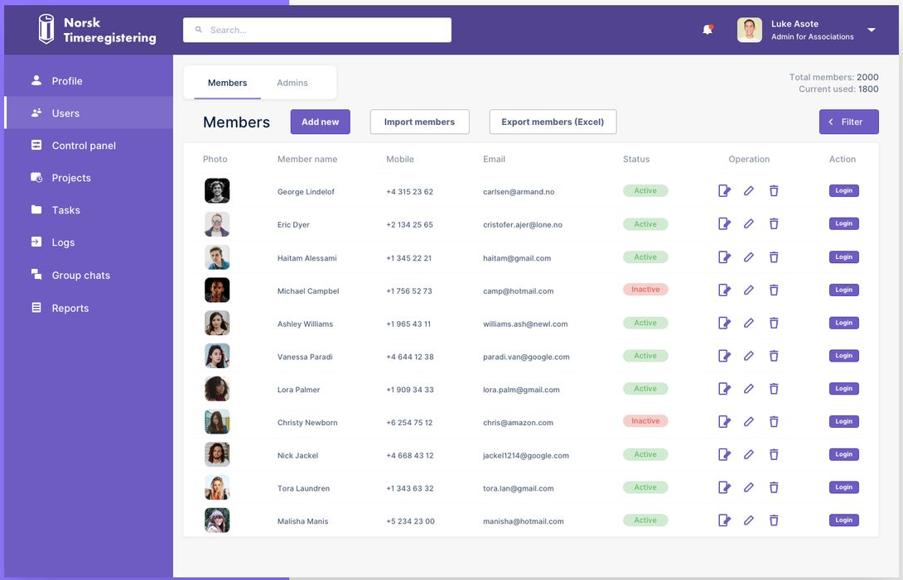
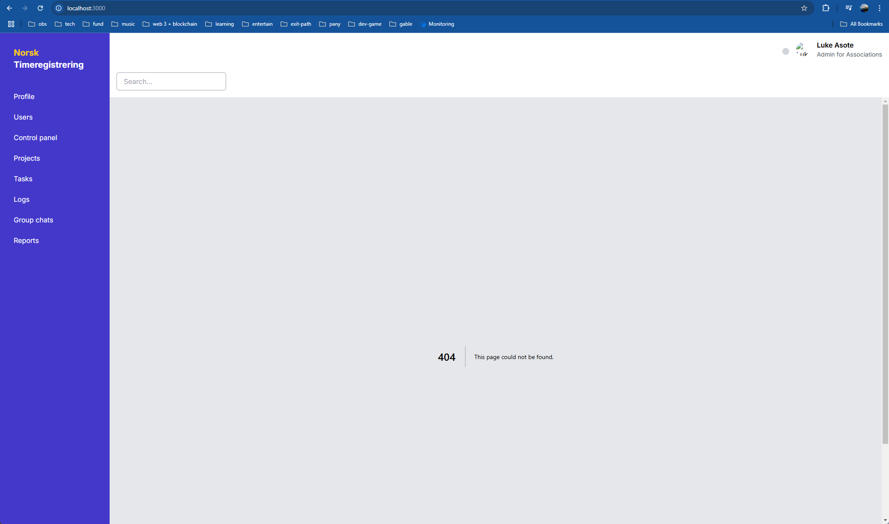
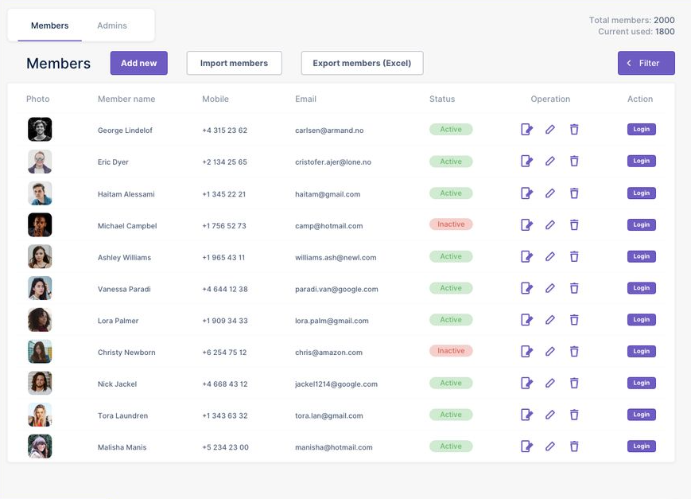
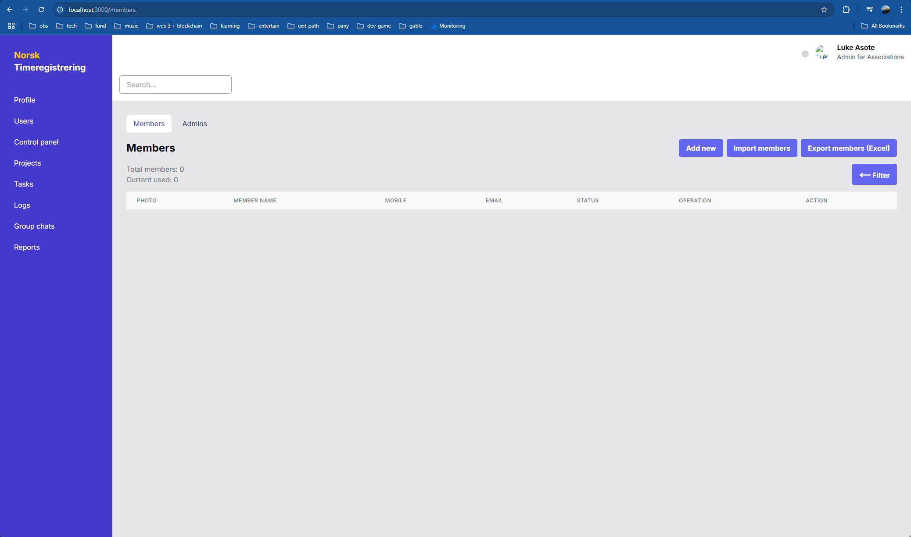
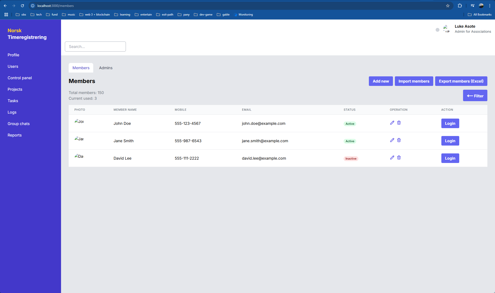

# example-ai-gen-ui-code

### Prompt Example 1



```
Instruction:
1. Act as a software engineer to write a code from the provided user interface.
2. Use NextJS as a framework with Tailwind css framework.
3. Reduce the duplicate code by create component code to reuse the component.
4. Provide a service to connect rest api.
5. Don't write code as a single file.
6. Separate source code with the follow NextJS standard and best practice.
7. Write a layout of the UI image. Search bar layout, sidebar layout, main layout. Leave a main layout to blank content.
```

### Output 1



---

### Prompt Example 2



```
Instruction:
1. modify the users menu content
2. write a code of users menu follow the provided ui image
```

### Output 2



---

### Prompt Example 3

```
mock data for service api getUser
```

### Output 3

